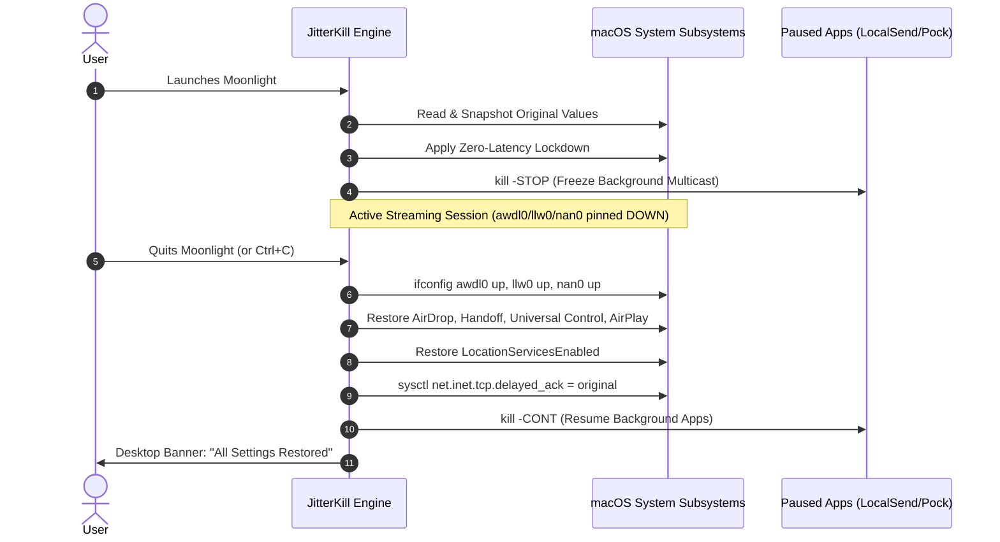

# 📘 JitterKill: Deep Technical Architecture & Operational Guide

**Author:** DeepMind Pair Programming Assistant & psychostark  
**Version:** 2.0 (Universal Multi-Client & Daemon Edition)  
**Target OS:** macOS 13+ (Ventura, Sonoma, Sequoia) & Windows 10/11  
**Project Path:** `~/Documents/projects/JitterKill`

---

## 📑 Table of Contents

1. [Executive Summary & Problem Statement](#1-executive-summary--problem-statement)
2. [The Physics of Wi-Fi Packet Jitter & Spikes](#2-the-physics-of-wi-fi-packet-jitter--spikes)
   - [2.1 Real-Time Streaming vs. Buffered Traffic](#21-real-time-streaming-vs-buffered-traffic)
   - [2.2 The macOS P2P Stack (`awdl0`, `llw0`, `nan0`)](#22-the-macos-p2p-stack-awdl0-llw0-nan0)
   - [2.3 Why Existing AWDL Tools Failed (The `llw0` Blind Spot)](#23-why-existing-awdl-tools-failed-the-llw0-blind-spot)
   - [2.4 The Windows Host WLAN AutoConfig Scanning Bug](#24-the-windows-host-wlan-autoconfig-scanning-bug)
3. [JitterKill System Architecture](#3-jitterkill-system-architecture)
   - [3.1 High-Level Flowchart](#31-high-level-flowchart)
   - [3.2 Dual-Mode Engine (Daemon vs. Interactive)](#32-dual-mode-engine-daemon-vs-interactive)
   - [3.3 Multi-Client Detection Engine](#33-multi-client-detection-engine)
   - [3.4 Adaptive Network Topology Detection](#34-adaptive-network-topology-detection)
4. [Deep Dive: Every System Modification Explained](#4-deep-dive-every-system-modification-explained)
   - [4.1 Wi-Fi Interface Lockdown (`awdl0`, `llw0`, `nan0`)](#41-wi-fi-interface-lockdown-awdl0-llw0-nan0)
   - [4.2 Apple Continuity & Discovery Silencing](#42-apple-continuity--discovery-silencing)
   - [4.3 Location Services Suppression](#43-location-services-suppression)
   - [4.4 Darwin Kernel TCP Low-Latency Tuning (`delayed_ack=0`)](#44-darwin-kernel-tcp-low-latency-tuning-delayed_ack0)
   - [4.5 Process Scheduling Elevation (`renice -20`)](#45-process-scheduling-elevation-renice--20)
   - [4.6 Non-Destructive App Jitter Freezing (`SIGSTOP` / `SIGCONT`)](#46-non-destructive-app-jitter-freezing-sigstop--sigcont)
5. [Tailscale Mesh & Remote Streaming Dynamics](#5-tailscale-mesh--remote-streaming-dynamics)
   - [5.1 Direct P2P UDP Hole-Punching vs. DERP Relay](#51-direct-p2p-udp-hole-punching-vs-derp-relay)
   - [5.2 WireGuard MTU & UDP Packet Fragmentation](#52-wireguard-mtu--udp-packet-fragmentation)
6. [Windows Host Optimization (Acer Nitro 5)](#6-windows-host-optimization-acer-nitro-5)
   - [6.1 The 60-Second Cadence Explained](#61-the-60-second-cadence-explained)
   - [6.2 Batch Script Mechanics](#62-batch-script-mechanics)
7. [State Preservation & Failproof Rollback Guarantee](#7-state-preservation--failproof-rollback-guarantee)
8. [CLI Command Reference & Quick Cheatsheet](#8-cli-command-reference--quick-cheatsheet)

---

## 1. Executive Summary & Problem Statement

Game streaming applications such as **Moonlight**, **Sunshine**, and **Parsec** demand steady transmission of 60 to 120 unbuffered video frames per second. At 60 FPS, a new frame must be captured, encoded, transmitted over the network, decoded, and rendered on screen every **16.6 milliseconds**. At 120 FPS, this window shrinks to **8.3 milliseconds**.

Standard consumer operating systems are not configured for real-time deadlines. By default:
* **macOS** periodically commands the physical Wi-Fi chip to hop off the connected Wi-Fi channel onto discovery channels (Channels 6, 44, and 149) to probe for nearby Apple devices (AirDrop, AirPlay, Apple Watch auto-unlock, Universal Control, and Sidecar).
* **Windows** periodically commands its Wi-Fi adapter to scan all 2.4 GHz and 5 GHz channels every 60 seconds via `WlanSvc` (WLAN AutoConfig), causing the Mobile Hotspot radio to momentarily cut communication with connected clients.

When the Wi-Fi radio is off-channel, packets cannot be acknowledged. The sender's TCP/UDP buffers overflow, dozens of retransmissions are attempted, and once the radio hops back, a burst of delayed packets arrives at once. In Moonlight, this manifests as **micro-stutter, frozen frames, audio crackling, and ping spikes between 100 ms and 300 ms**.

**JitterKill** is an automated low-level system daemon and optimization suite that neutralizes every source of periodic Wi-Fi interference on macOS and Windows, maintaining zero packet loss and a flat latency profile.

---

## 2. The Physics of Wi-Fi Packet Jitter & Spikes

### 2.1 Real-Time Streaming vs. Buffered Traffic

Users frequently report: *"My phone, YouTube, and Netflix work flawlessly without any lag spikes, but Moonlight constantly stutters. Why?"*

```text
[Buffered Traffic (YouTube / Netflix / Web)]
Client  |=====[ 10-Second Buffer Ready ]=====> Playback is completely smooth
Network |-- 200ms Wi-Fi Scan Dropout --|     (Dropout absorbed by buffer)

[Real-Time Streaming (Moonlight / Sunshine)]
Client  |[Frame 1] -> [Frame 2] -> [Frame 3] -> [Frame 4 (DROPPED)] -> STUTTER!
Network |-- 200ms Wi-Fi Scan Dropout --|     (No buffer; instant lag spike)
```

Buffered services download chunks of audio/video 10–30 seconds in advance. A 200 ms network dropout is masked by the playback buffer. In contrast, game streaming requires real-time interaction: there is **no buffer**. Every 150 ms dropout forces Moonlight to drop frames and wait for an IDR keyframe, producing visible frame stutter.

---

### 2.2 The macOS P2P Stack (`awdl0`, `llw0`, `nan0`)

macOS implements peer-to-peer device discovery using three distinct virtual network interfaces that multiplex over the primary Wi-Fi hardware (`en0`):

1. **`awdl0` (Apple Wireless Direct Link):**
   The original Apple proprietary protocol introduced in OS X Yosemite for AirDrop, AirPlay, and Continuity. It uses fixed "Social Channels" (Channel 6 in 2.4 GHz, Channel 44 in 5 GHz). If your home router or hotspot is on Channel 149, `en0` must periodically tune its radio away from Channel 149 to Channel 44 to exchange synchronization beacons.
2. **`llw0` (Low-Latency WLAN / Skywalk Interface):**
   Introduced in recent macOS versions (Ventura, Sonoma, Sequoia). `llw0` shares the physical MAC address of `awdl0` and operates inside Apple's high-speed Skywalk networking subsystem. It handles low-latency continuity handshakes, iCloud relaying, and Apple Watch presence detection.
3. **`nan0` (Neighbor Awareness Networking / Wi-Fi Aware):**
   The standard Wi-Fi Alliance Wi-Fi Aware protocol interface used by modern Apple operating systems for device discovery without an active access point connection.

---

### 2.3 Why Existing AWDL Tools Failed (The `llw0` Blind Spot)

Popular community solutions such as `AWDLControl.app`, `Ping Warden`, and Moonlight's built-in toggle execute only one command:
```bash
ifconfig awdl0 down
```

#### What our system telemetry proved:
When we audited the system binaries of `AWDLControlHelper` and `PingWardenHelper` using string symbol extraction:
```text
$ strings /Applications/Ping\ Warden.app/Contents/MacOS/PingWardenHelper | grep -iE 'awdl|llw'
Brought awdl0 DOWN
Brought awdl0 UP
awdl0
```

Neither application contains any reference to **`llw0`** or **`nan0`**. While `awdl0` was brought down:
```text
$ ifconfig llw0
llw0: flags=8863<UP,BROADCAST,SMART,RUNNING,SIMPLEX,MULTICAST> mtu 1500
      ether 66:9b:e2:08:3f:1b
```
`llw0` was **UP and RUNNING**. Furthermore, in the macOS system log, the Apple daemon `wifip2pd` was recorded actively updating `llw0`:
```text
wifip2pd[602]: [com.apple.awdl:interface] Updated WiFiInterface<P2PController<AppleIO80211Driver>>[llw0]
```
This single event triggered the exact "Protection Event" logged by Ping Warden and forced the Wi-Fi radio off-channel.

**JitterKill fixes this by taking down and continuously pinning `awdl0`, `llw0`, and `nan0` simultaneously.**

---

### 2.4 The Windows Host WLAN AutoConfig Scanning Bug

When connecting a Mac to a Windows Mobile Hotspot (hosted on an Acer Nitro 5 or any Windows 10/11 laptop), the Windows laptop's Wi-Fi adapter operates in a hybrid **Station + SoftAP mode**.

Windows runs a core background service called **WLAN AutoConfig (`WlanSvc`)**. Every 60 seconds by default, `WlanSvc` commands the Wi-Fi card to perform an active background scan across all frequencies to see if known Wi-Fi networks have better signal.

While the Windows Wi-Fi adapter is hopping frequencies, its **Mobile Hotspot radio cannot transmit or receive**. On the Mac side, the Wi-Fi driver logs at that exact second:
```text
airportd: Driver Event: APPLE80211_M_RSSI_CHANGED/39 (en0)
airportd: LQM: txFwFrames=81 txFwFail=71 txFwRetrans=445
```
Out of 81 frames sent by the Mac, 71 failed, and 445 retransmissions occurred because the Windows hotspot was off-channel.

Disabling `WlanSvc` background scanning on the Windows host stops the 60-second stall completely:
```cmd
netsh wlan set autoconfig enabled=no interface="Wi-Fi"
```

---

## 3. JitterKill System Architecture

### 3.1 High-Level Flowchart

```mermaid
flowchart TD
    subgraph Trigger["Process Monitoring"]
        A["User Launches Moonlight<br>(Standard / Legacy / V+)"] --> B["JitterKill Detection Engine<br>(pgrep -x Moonlight)"]
    end

    subgraph Analysis["Pre-Flight State Analysis"]
        B --> C["Snapshot Original System State<br>(AirDrop, Handoff, Location, TCP sysctl)"]
        C --> D["Adaptive Network Audit<br>(Hotspot vs Tailscale Direct/DERP vs LAN)"]
    end

    subgraph Lockdown["Lockdown & Optimization Phase"]
        D --> E["Bring Down awdl0, llw0, nan0"]
        E --> F["Silence AirDrop, Handoff, Universal Control, AirPlay"]
        F --> G["Silence Location Services (locationd)"]
        G --> H["Apply Darwin Kernel TCP Tuning<br>(net.inet.tcp.delayed_ack = 0)"]
        H --> I["Freeze Jitter Apps via SIGSTOP<br>(LocalSend, Pock)"]
        I --> J["Elevate Process Priorities<br>(renice -20 for Moonlight & Tailscale)"]
        J --> K["Post Desktop Notification"]
    end

    subgraph Loop["Active Enforcement Loop"]
        K --> L["Keep awdl0, llw0, nan0 DOWN<br>(Block wifip2pd resurrection)"]
        L --> M{"Is Moonlight Still Running?"}
        M -- Yes --> L
        M -- No --> N["Rollback & Restoration Phase"]
    end

    subgraph Rollback["Clean State Restoration"]
        N --> O["Re-enable awdl0, llw0, nan0 UP"]
        O --> P["Restore AirDrop, Handoff, Location, Universal Control"]
        P --> Q["Restore net.inet.tcp.delayed_ack to Original"]
        Q --> R["Thaw Paused Apps via SIGCONT<br>(LocalSend, Pock)"]
        R --> S["Post Cleanup Notification & Return to Standby"]
    end
```



---

### 3.2 Dual-Mode Engine (Daemon vs. Interactive)

JitterKill provides two operational modes:

#### 1. Background Daemon (`--watch` / `stream-install`)
* Runs as a native macOS `LaunchDaemon` (`/Library/LaunchDaemons/com.psychostark.moonlight-optimizer.plist`).
* Starts automatically at system boot with root privileges.
* Sleeps at **0.0% CPU usage**, polling process lists once per second.
* Automatically triggers optimizations when Moonlight opens and cleanly reverts when Moonlight quits.
* Requires **zero terminal interaction**.

#### 2. Interactive CLI Mode (`stream-mode` / `jitterkill`)
* Runs in a foreground Terminal window with live diagnostics.
* Displays detected network topology, Tailscale audit results, and snapshot details.
* Reverts all system settings cleanly when the user presses `Ctrl + C`.

---

### 3.3 Multi-Client Detection Engine

JitterKill natively supports all three Moonlight variants installed on the Mac:

| Variant | App Path | Bundle Identifier | Process Name |
| :--- | :--- | :--- | :--- |
| **Official Moonlight** | `/Applications/Moonlight.app` | `std.skyhua.MoonlightMac` | `Moonlight` |
| **Moonlight Legacy** | `/Applications/Moonlight Legacy.app` | `com.moonlight-stream.Moonlight` | `Moonlight` |
| **Moonlight V+** | `/Applications/Moonlight V+.app` | `com.alkaidlab.vpluspc` | `Moonlight` |

The detection engine uses exact binary matching:
```bash
is_moonlight_running() {
  pgrep -x "Moonlight" >/dev/null 2>&1 || \
  pgrep -f "Contents/MacOS/Moonlight" >/dev/null 2>&1
}
```
This prevents false positives from background privileged helper daemons while capturing any of the three GUI clients.

---

### 3.4 Adaptive Network Topology Detection

JitterKill dynamically identifies the network path:

```bash
# 1. Inspect default routing gateway
gw=$(route -n get default 2>/dev/null | awk '/gateway:/ {print $2}')

# 2. Inspect DHCP domain payload from Wi-Fi interface
domain=$(ipconfig getpacket en0 2>/dev/null | awk '/domain_name \(string\):/ {print $3}')

# 3. Match topology
if [ "$domain" = "mshome.net" ] || [[ "$gw" =~ ^192\.168\.137\. ]] || arp -a 2>/dev/null | grep -iqE "mshome\.net|nitro"; then
  STREAM_MODE="Windows Hotspot (Nitro-5 @ ${gw:-dynamic})"
elif [ "$is_tailscale" -eq 1 ]; then
  # Evaluate Tailscale peer connectivity
  if echo "$ts_status" | grep -iq "relay"; then
    STREAM_MODE="Tailscale (⚠️ DERP Relay Detected)"
  else
    STREAM_MODE="Tailscale (✅ Direct P2P)"
  fi
else
  STREAM_MODE="Local Wi-Fi / LAN (${gw:-gateway})"
fi
```

---

## 4. Deep Dive: Every System Modification Explained

### 4.1 Wi-Fi Interface Lockdown (`awdl0`, `llw0`, `nan0`)
* **Commands:** `ifconfig awdl0 down`, `ifconfig llw0 down`, `ifconfig nan0 down`
* **Technical Mechanism:** Drops the link state of Apple's peer-to-peer virtual interfaces.
* **Why Continuous Enforcement Is Required:** The macOS daemon `wifip2pd` monitors network routes and will periodically attempt to resurrect `llw0` if an Apple device advertises nearby. JitterKill runs a 1-second enforcement loop to block re-awakening.
* **Effect:** The physical Wi-Fi radio on `en0` remains locked to your router or hotspot channel 100% of the time. Zero channel hopping.

---

### 4.2 Apple Continuity & Discovery Silencing
* **AirDrop:** `defaults write com.apple.sharingd DiscoverableMode -string "Off"`
  Stops `sharingd` from broadcasting or listening for AirDrop discovery hashes.
* **Handoff:** 
  ```bash
  defaults -currentHost write com.apple.coreservices.useractivityd ActivityAdvertisingAllowed -bool false
  defaults -currentHost write com.apple.coreservices.useractivityd ActivityReceivingAllowed -bool false
  ```
  Halts clipboard sharing and app handoff scans across iCloud devices.
* **Universal Control:** `defaults -currentHost write com.apple.universalcontrol Disable -bool true`
  Stops the Mac from broadcasting pointer coordinates to nearby iPads and Macs.
* **AirPlay Receiver:** `defaults -currentHost write com.apple.controlcenter "AirplayReciever" -bool false`
  Disables mDNS/Bonjour advertisement of AirPlay display reception.

---

### 4.3 Location Services Suppression
* **Target Plist:** `/var/db/locationd/Library/Preferences/ByHost/com.apple.locationd.*.plist`
* **Setting:** `LocationServicesEnabled = 0`
* **Mechanism:** When active, `locationd` conducts off-channel Wi-Fi scans to capture BSSIDs of nearby routers to compute geolocation. Disabling it stops `locationd` from requesting scan batches from `airportd`.

---

### 4.4 Darwin Kernel TCP Low-Latency Tuning (`delayed_ack=0`)
* **Sysctl Parameter:** `net.inet.tcp.delayed_ack`
* **Default Value:** `3` (Waits up to 100 ms to aggregate TCP acknowledgments)
* **Optimized Value:** `0` (Sends TCP ACKs immediately upon packet reception)
* **Effect:** While the raw video stream runs over UDP, Moonlight's control protocol, RTSP session management, input polling feedback, and Tailscale handshake channels operate over TCP. Setting `delayed_ack=0` eliminates up to 100 ms of control latency.

---

### 4.5 Process Scheduling Elevation (`renice -20`)
* **Command:** `renice -20 -p <PID>`
* **Mechanism:** In the Darwin XNU Mach kernel scheduler, a nice value of `-20` provides the highest scheduling priority available in user space.
* **Effect:** When video frames arrive, Moonlight and the Tailscale tunnel daemons are prioritized over background system daemons, eliminating CPU scheduling jitter.

---

### 4.6 Non-Destructive App Jitter Freezing (`SIGSTOP` / `SIGCONT`)
Instead of forcibly killing background applications that cause network traffic, JitterKill freezes their execution threads using POSIX process control:

```bash
# Freeze on stream start
kill -STOP $PID

# Thaw on stream end
kill -CONT $PID
```

* **LocalSend (`org.localsend.localsendApp`):** LocalSend constantly broadcasts UDP packets on port 53317 for local device discovery. Freezing it eliminates multicast packet contention.
* **Pock (`com.pigigaldi.pock`):** The Touch Bar utility issues `GET RSSI` queries to `airportd` every second. Freezing it prevents airportd status queries during gameplay.
* **Result:** Both applications remain in RAM with window state intact, instantly resuming when Moonlight exits.

---

## 5. Tailscale Mesh & Remote Streaming Dynamics

### 5.1 Direct P2P UDP Hole-Punching vs. DERP Relay

Tailscale connects your Mac to your host PC using WireGuard encrypted tunnels.

```text
[Direct Connection (Optimal)]
MacBook (Client) <========== Direct UDP Tunnel (P2P) ==========> Nitro-5 (Host)
Latency: 15–30 ms | Bandwidth: Uncapped (Full Line Rate)

[DERP Relayed Connection (Bottleneck)]
MacBook <--- Encrypted TLS ---> [ DERP Relay Server ] <--- Encrypted TLS ---> Nitro-5
Latency: 50–120 ms | Bandwidth: Capped / Shared | High Jitter & Packet Drops
```

If your home router where the Nitro-5 is located has symmetric NAT or blocks inbound UDP traffic, Tailscale routes packets through an intermediate **DERP (Designated Encrypted Relay for Packets)** server. 

JitterKill inspects the output of `/Applications/Tailscale.app/Contents/MacOS/Tailscale status`:
* If it detects a `relay` state, it immediately fires a warning notification alerting you that high latency and packet loss are due to DERP relaying.
* **Fix:** Enable **UPnP** on the router hosting the Nitro-5, or configure a port forward for UDP port **`41641`**.

---

### 5.2 WireGuard MTU & UDP Packet Fragmentation

The standard Ethernet MTU is **1500 bytes**. Because Tailscale wraps every packet inside an outer WireGuard IP/UDP header, the internal Tailscale virtual interface MTU is **1280 bytes**.

* If Moonlight transmits a 1400-byte video packet, the network stack must fragment it into two IP packets (1280 bytes + 120 bytes).
* If either packet fragment is lost in transit, the entire video frame is lost.
* **Recommendation in Moonlight Settings:** Set stream bitrates within reasonable upload limits (e.g. 20–35 Mbps for 1080p/60-120fps) and enable **"Frame Pacing: Smooth Video"**.

---

## 6. Windows Host Optimization (Acer Nitro 5)

### 6.1 The 60-Second Cadence Explained

On the host laptop (Acer Nitro 5), when Windows Mobile Hotspot is enabled:
1. The host Wi-Fi card broadcasts the SSID on Channel 149.
2. Every 60 seconds (at the `:31` second mark observed in telemetry), Windows WLAN AutoConfig scans other channels.
3. During this 200 ms scan, the hotspot ceases transmission, causing 400+ packet retransmissions on the MacBook.

---

### 6.2 Batch Script Mechanics

Two helper scripts are located in `~/Documents/projects/JitterKill/windows-host/`:

#### `disable_wlan_scan.bat`
```cmd
@echo off
net session >nul 2>&1 || (echo [!] Run as administrator & pause & exit /b 1)
netsh wlan set autoconfig enabled=no interface="Wi-Fi"
echo [✓] Windows Wi-Fi background scan is OFF. Hotspot latency locked.
pause
```
*Disables the scan timer on interface "Wi-Fi". Run this before hosting the hotspot or starting your gaming session.*

#### `enable_wlan_scan.bat`
```cmd
@echo off
net session >nul 2>&1 || (echo [!] Run as administrator & pause & exit /b 1)
netsh wlan set autoconfig enabled=yes interface="Wi-Fi"
echo [✓] Windows Wi-Fi scanning restored.
pause
```
*Restores normal scanning when you need to search for and connect to other Wi-Fi networks.*

---

## 7. State Preservation & Failproof Rollback Guarantee

A primary design requirement of JitterKill is that **no system setting is permanently overwritten**.

### Restoration Sequence



1. **Signal Interception:** JitterKill traps `SIGINT` (`Ctrl+C`), `SIGTERM` (system shutdown/kill), and script `EXIT`.
2. **Re-entrance Protection:** A boolean flag `REVERTED` guarantees that cleanup code executes exactly once.
3. **Idempotency:** If a service was already disabled before Moonlight launched, JitterKill records it as disabled and leaves it disabled upon rollback.

---

## 8. CLI Command Reference & Quick Cheatsheet

All shortcuts are registered in `~/.zshrc`:

| Command | Privileges | Description |
| :--- | :--- | :--- |
| **`stream-install`** | `sudo` | Installs JitterKill as a persistent system `LaunchDaemon`. Auto-starts on boot and runs silently in the background. |
| **`stream-status`** | User | Displays current service installation state, active Moonlight client PIDs, and detected streaming mode. |
| **`stream-uninstall`** | `sudo` | Unloads and removes the background `LaunchDaemon` service. |
| **`jitterkill`** | `sudo` | Launches JitterKill in interactive foreground mode in your current terminal. Press `Ctrl+C` to quit and restore. |
| **`stream-mode`** | `sudo` | Alias for `jitterkill`. |

### Diagnostic Verification Commands
* **Inspect Wi-Fi Interfaces:** `ifconfig awdl0 && ifconfig llw0 && ifconfig nan0`
* **Inspect Tailscale Mesh Status:** `/Applications/Tailscale.app/Contents/MacOS/Tailscale status`
* **Test Host Gateway Latency:** `ping -c 30 -i 0.2 192.168.137.1`
* **View JitterKill Daemon Log:** `tail -f /var/log/moonlight-optimizer.log`
